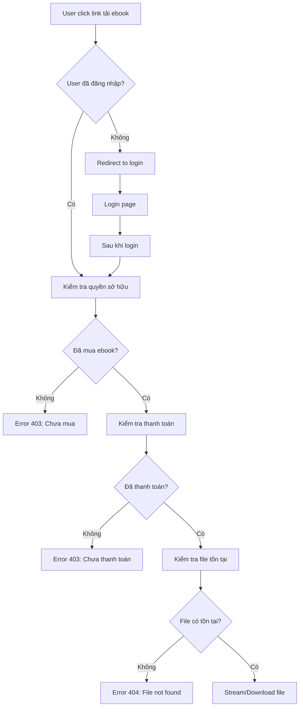
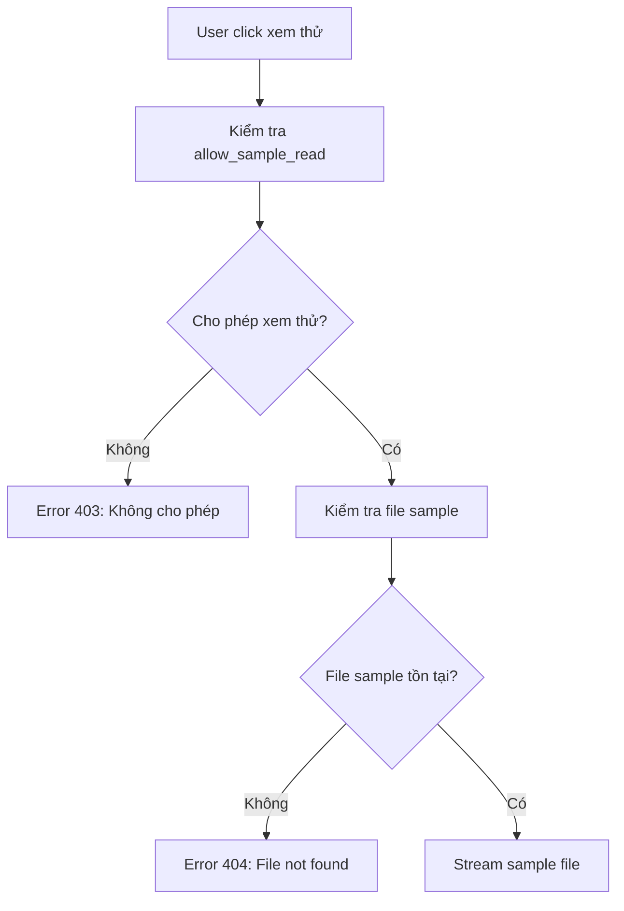

# Tài liệu Bảo mật Tải Ebook

## Tổng quan

Tài liệu này mô tả các cải tiến bảo mật đã được triển khai cho hệ thống tải ebook nhằm đảm bảo chỉ những người dùng đã mua sách mới có thể truy cập và tải ebook.

## Vấn đề trước đây

### 🚨 Bảo mật yếu
- File ebook được lưu trong thư mục `storage/app/public/ebooks/`
- Link tải trực tiếp: `{{ asset('storage/' . $bookFormat->file_url) }}`
- Bất kỳ ai có link đều có thể tải ebook mà không cần xác thực
- Không kiểm tra quyền sở hữu hoặc trạng thái thanh toán

### 📁 Cấu trúc file không an toàn
```
storage/app/public/ebooks/
├── 1234567890_ebook1.pdf  ← Có thể truy cập trực tiếp
├── 1234567891_ebook2.pdf  ← Có thể truy cập trực tiếp
└── samples/
    ├── sample1.pdf        ← Có thể truy cập trực tiếp
    └── sample2.pdf        ← Có thể truy cập trực tiếp
```

## Giải pháp bảo mật mới

### 🔒 Controller bảo mật

Đã tạo `EbookDownloadController` với các phương thức:

#### 1. Download Ebook An toàn (`/ebook/download/{formatId}`)
- **Yêu cầu đăng nhập**: Kiểm tra `Auth::check()`
- **Xác thực quyền sở hữu**: Kiểm tra user đã mua ebook
- **Kiểm tra thanh toán**: Đơn hàng phải có trạng thái "Đã Thanh Toán"
- **Kiểm tra định dạng**: Chỉ cho phép tải định dạng "Ebook"
- **Kiểm tra file tồn tại**: Đảm bảo file có trên server

#### 2. Xem Ebook Online (`/ebook/view/{formatId}`)
- Tương tự download nhưng stream file thay vì tải xuống
- Hiển thị PDF trực tiếp trong trình duyệt
- Không cho phép lưu file

#### 3. Download Sample (`/ebook/sample/download/{formatId}`)
- **Không yêu cầu đăng nhập** (public access)
- Kiểm tra `allow_sample_read = true`
- Chỉ cho phép tải file sample

#### 4. Xem Sample Online (`/ebook/sample/view/{formatId}`)
- Tương tự download sample nhưng xem online
- Không yêu cầu đăng nhập

### 🛡️ Logic xác thực quyền sở hữu

```php
$hasPurchased = Order::where('user_id', $user->id)
    ->whereHas('orderItems', function ($query) use ($bookFormat) {
        $query->where(function ($q) use ($bookFormat) {
            // Trường hợp 1: Mua trực tiếp ebook
            $q->where('book_format_id', $bookFormat->id)
              ->where('is_combo', false);
        })->orWhere(function ($q) use ($bookFormat) {
            // Trường hợp 2: Mua sách vật lý có ebook kèm theo
            $q->where('book_id', $bookFormat->book_id)
              ->where('is_combo', false)
              ->whereHas('bookFormat', function ($subQuery) {
                  $subQuery->where('format_name', '!=', 'Ebook');
              });
        });
    })
    ->whereHas('paymentStatus', function ($query) {
        $query->where('name', 'Đã Thanh Toán');
    })
    ->exists();
```

### 🔗 Routes bảo mật

```php
// Ebook Download routes - Secure download with authentication
Route::prefix('ebook')->name('ebook.')->group(function() {
    // Sample downloads (public access)
    Route::get('/sample/download/{formatId}', [EbookDownloadController::class, 'downloadSample'])->name('sample.download');
    Route::get('/sample/view/{formatId}', [EbookDownloadController::class, 'viewSample'])->name('sample.view');
    
    // Protected downloads (require authentication and purchase)
    Route::middleware('auth')->group(function() {
        Route::get('/download/{formatId}', [EbookDownloadController::class, 'download'])->name('download');
        Route::get('/view/{formatId}', [EbookDownloadController::class, 'view'])->name('view');
    });
});
```

## Cập nhật giao diện

### 📧 Email Template
**File**: `resources/views/emails/orders/ebook-purchase-confirmation.blade.php`

**Trước**:
```blade
<a href="{{ asset('storage/' . $item->bookFormat->file_url) }}" class="button" target="_blank">
    Tải Ebook
</a>
```

**Sau**:
```blade
<a href="{{ route('ebook.download', $item->bookFormat->id) }}" class="button" target="_blank">
    Tải Ebook
</a>
```

### 📱 Trang Chi tiết Đơn hàng
**File**: `resources/views/clients/account/order-details.blade.php`

**Thêm mới**: Phần "TẢI EBOOK" cho đơn hàng đã thanh toán
- Hiển thị danh sách ebook có thể tải
- Nút "Đọc Online" và "Tải Xuống"
- Phân biệt ebook mua trực tiếp và ebook kèm theo
- Chỉ hiển thị khi `paymentStatus = 'Đã Thanh Toán'`

### 🔍 Trang Chi tiết Sách
**File**: `resources/views/clients/show.blade.php`

**Cập nhật**: Link xem thử sample
```blade
<!-- Trước -->
data-sample-url="{{ asset('storage/' . $format->sample_file_url) }}"

<!-- Sau -->
data-sample-url="{{ route('ebook.sample.view', $format->id) }}"
```

### 👨‍💼 Admin Book Management
**File**: `resources/views/admin/books/show.blade.php`

**Cập nhật**: Link tải và xem thử cho admin
```blade
<!-- Tải ebook -->
<a href="{{ route('ebook.download', $format->id) }}" target="_blank" class="btn btn-sm btn-info">
    <i class="ri-download-line"></i> Tải xuống
</a>

<!-- Xem thử -->
<a href="{{ route('ebook.sample.view', $format->id) }}" target="_blank" class="btn btn-sm btn-outline-info">
    <i class="ri-eye-line"></i> Xem thử
</a>
```

## Tính năng bảo mật

### ✅ Kiểm tra xác thực
1. **Đăng nhập bắt buộc**: Chỉ user đã đăng nhập mới tải được ebook
2. **Quyền sở hữu**: Kiểm tra user đã mua ebook hay chưa
3. **Trạng thái thanh toán**: Đơn hàng phải đã thanh toán
4. **Định dạng hợp lệ**: Chỉ cho phép tải file ebook

### 🔐 Bảo vệ file
1. **Không truy cập trực tiếp**: File không thể truy cập qua URL trực tiếp
2. **Stream an toàn**: File được stream qua controller với header bảo mật
3. **Cache control**: Ngăn cache file ở browser
4. **Error handling**: Xử lý lỗi 401, 403, 404 phù hợp

### 📊 Logging và Monitoring
1. **Access logs**: Ghi lại mọi lần truy cập ebook
2. **Error tracking**: Theo dõi các lỗi truy cập
3. **Security alerts**: Cảnh báo khi có truy cập bất thường

## Luồng hoạt động mới

### 🔄 Luồng tải ebook


### 🔄 Luồng xem sample


## Lợi ích

### 🛡️ Bảo mật
- **Ngăn chặn truy cập trái phép**: Chỉ người mua mới tải được
- **Bảo vệ tài sản số**: Ebook không bị chia sẻ tự do
- **Kiểm soát truy cập**: Theo dõi được ai tải gì, khi nào

### 💰 Kinh doanh
- **Bảo vệ doanh thu**: Ngăn chặn piracy
- **Tăng giá trị**: Ebook trở nên có giá trị hơn
- **Trải nghiệm tốt**: User có thể đọc online hoặc tải về

### 🔧 Kỹ thuật
- **Dễ bảo trì**: Code rõ ràng, có cấu trúc
- **Mở rộng được**: Dễ thêm tính năng mới
- **Performance tốt**: Stream file hiệu quả

## Kiểm tra bảo mật

### ✅ Test cases

1. **Test truy cập không đăng nhập**
   - Truy cập `/ebook/download/123` → 401 Unauthorized
   - Truy cập `/ebook/view/123` → 401 Unauthorized

2. **Test truy cập chưa mua**
   - User A truy cập ebook của User B → 403 Forbidden
   - User chưa mua truy cập ebook → 403 Forbidden

3. **Test truy cập chưa thanh toán**
   - User có đơn hàng chưa thanh toán → 403 Forbidden

4. **Test truy cập hợp lệ**
   - User đã mua và thanh toán → 200 OK + file stream

5. **Test sample access**
   - Truy cập sample không cần đăng nhập → 200 OK
   - Truy cập sample khi `allow_sample_read = false` → 403 Forbidden

### 🔍 Monitoring

1. **Log access patterns**
   - Theo dõi số lần tải của mỗi user
   - Phát hiện pattern bất thường

2. **Performance monitoring**
   - Thời gian response của download
   - Bandwidth usage

3. **Error tracking**
   - Số lượng 403/404 errors
   - Failed download attempts

## Kết luận

Hệ thống bảo mật ebook mới đã được triển khai thành công với các tính năng:

✅ **Xác thực người dùng** - Chỉ user đã đăng nhập mới truy cập được
✅ **Kiểm tra quyền sở hữu** - Chỉ người mua mới tải được
✅ **Bảo vệ file** - File không thể truy cập trực tiếp
✅ **Trải nghiệm tốt** - Có thể đọc online hoặc tải về
✅ **Sample miễn phí** - Cho phép xem thử không cần đăng nhập
✅ **Admin friendly** - Admin có thể truy cập mọi file

Hệ thống này đảm bảo tính bảo mật cao cho ebook trong khi vẫn mang lại trải nghiệm người dùng tốt.