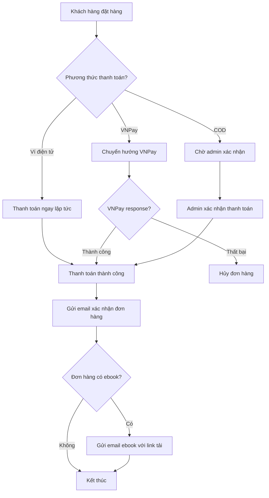

# Chức năng gửi email kèm link tải ebook

## Mô tả chức năng

Chức năng này tự động gửi email kèm link tải ebook cho khách hàng khi:
1. **Mua trực tiếp ebook** và đã thanh toán thành công
2. **Mua sách vật lý** nhưng sách đó có **ebook kèm theo** và đã thanh toán thành công

## Cách hoạt động

### 1. Khi nào email được gửi?

Email ebook sẽ được gửi tự động trong các trường hợp sau:
- **Thanh toán bằng ví điện tử**: Ngay sau khi thanh toán thành công
- **Thanh toán VNPay**: Ngay sau khi VNPay xác nhận thanh toán thành công
- **Thanh toán COD**: Khi admin xác nhận đã nhận được tiền từ khách hàng

### 2. Logic kiểm tra ebook

Hệ thống sẽ kiểm tra:
1. **Ebook trực tiếp**: `orderItem.bookFormat.format_name === 'Ebook'`
2. **Ebook kèm theo**: `orderItem.book.formats.contains('format_name', 'Ebook')`

### 3. Nội dung email

Email bao gồm:
- Thông tin đơn hàng
- Danh sách ebook có thể tải
- Link tải trực tiếp cho từng ebook
- Phân biệt ebook mua trực tiếp và ebook kèm theo

## Files đã thay đổi

### 1. OrderController.php
**Đường dẫn**: `app/Http/Controllers/OrderController.php`

**Thay đổi**:
- Thêm `$this->emailService->sendEbookPurchaseConfirmation($order);` vào phần xử lý thanh toán ví điện tử
- Thêm `$this->emailService->sendEbookPurchaseConfirmation($order);` vào phần xử lý VNPay return thành công

```php
// Thanh toán ví điện tử
$this->emailService->sendOrderConfirmation($order);
$this->emailService->sendEbookPurchaseConfirmation($order); // ← Thêm mới

// Thanh toán VNPay thành công
$this->emailService->sendOrderConfirmation($order);
$this->emailService->sendEbookPurchaseConfirmation($order); // ← Thêm mới
```

### 2. EmailService.php
**Đường dẫn**: `app/Services/EmailService.php`

**Cải thiện**:
- Mở rộng logic kiểm tra ebook để bao gồm cả ebook kèm theo sách vật lý
- Thêm logging để theo dõi quá trình gửi email
- Thêm try-catch để xử lý lỗi

```php
public function sendEbookPurchaseConfirmation(Order $order)
{
    // Load thêm relationship book.formats
    $order->load([
        'user', 
        'orderItems.book.authors', 
        'orderItems.book.formats', // ← Thêm mới
        'orderItems.bookFormat',
        'orderItems.collection'
    ]);

    // Logic kiểm tra mở rộng
    $hasEbooks = $order->orderItems->some(function ($item) {
        // Trường hợp 1: Mua trực tiếp ebook
        if (!$item->is_combo && $item->bookFormat && $item->bookFormat->format_name === 'Ebook') {
            return true;
        }
        
        // Trường hợp 2: Mua sách vật lý nhưng có ebook kèm theo
        if (!$item->is_combo && $item->book && $item->book->formats) {
            return $item->book->formats->contains('format_name', 'Ebook');
        }
        
        return false;
    });
    
    // Thêm logging và error handling
    if (!$hasEbooks) {
        Log::info('No ebooks found in order', ['order_id' => $order->id]);
        return;
    }

    try {
        Mail::to($order->user->email)
            ->send(new EbookPurchaseConfirmation($order));
        Log::info('Ebook purchase confirmation email sent', ['order_id' => $order->id]);
    } catch (\Exception $e) {
        Log::error('Failed to send ebook purchase confirmation email', [
            'order_id' => $order->id,
            'error' => $e->getMessage()
        ]);
    }
}
```

### 3. ebook-purchase-confirmation.blade.php
**Đường dẫn**: `resources/views/emails/orders/ebook-purchase-confirmation.blade.php`

**Cải thiện**:
- Hiển thị cả ebook mua trực tiếp và ebook kèm theo
- Phân biệt rõ ràng hai loại ebook
- Thêm kiểm tra an toàn để tránh lỗi

```blade
<h3>Chi tiết ebook có thể tải:</h3>
@foreach($order->orderItems as $item)
    @if(!$item->is_combo && $item->book)
        {{-- Trường hợp 1: Mua trực tiếp ebook --}}
        @if($item->bookFormat && $item->bookFormat->format_name === 'Ebook')
        <div class="book-item">
            <h4>{{ $item->book->title ?? 'Sách không xác định' }}</h4>
            <p>Định dạng: Ebook (Mua trực tiếp)</p>
            @if($item->book->authors->isNotEmpty())
                <p>Tác giả: {{ $item->book->authors->first()->name }}</p>
            @endif
            <a href="{{ asset('storage/' . $item->bookFormat->file_url) }}" class="button" target="_blank">
                Tải Ebook
            </a>
        </div>
        {{-- Trường hợp 2: Mua sách vật lý nhưng có ebook kèm theo --}}
        @elseif($item->bookFormat && $item->bookFormat->format_name !== 'Ebook' && $item->book->formats->contains('format_name', 'Ebook'))
            @php
                $ebookFormat = $item->book->formats->where('format_name', 'Ebook')->first();
            @endphp
            @if($ebookFormat && $ebookFormat->file_url)
            <div class="book-item">
                <h4>{{ $item->book->title ?? 'Sách không xác định' }}</h4>
                <p>Định dạng: Ebook (Kèm theo sách vật lý)</p>
                @if($item->book->authors->isNotEmpty())
                    <p>Tác giả: {{ $item->book->authors->first()->name }}</p>
                @endif
                <a href="{{ asset('storage/' . $ebookFormat->file_url) }}" class="button" target="_blank">
                    Tải Ebook
                </a>
            </div>
            @endif
        @endif
    @endif
@endforeach
```

## Luồng hoạt động



## Kiểm tra chức năng

### 1. Test case 1: Mua ebook trực tiếp
1. Thêm ebook vào giỏ hàng
2. Thanh toán bằng ví điện tử hoặc VNPay
3. Kiểm tra email nhận được có link tải ebook

### 2. Test case 2: Mua sách vật lý có ebook kèm theo
1. Thêm sách vật lý (có ebook) vào giỏ hàng
2. Thanh toán thành công
3. Kiểm tra email nhận được có link tải ebook kèm theo

### 3. Test case 3: Mua sách vật lý không có ebook
1. Thêm sách vật lý (không có ebook) vào giỏ hàng
2. Thanh toán thành công
3. Kiểm tra không nhận được email ebook

### 4. Test case 4: COD
1. Đặt hàng ebook với phương thức COD
2. Admin xác nhận thanh toán
3. Kiểm tra email ebook được gửi sau khi admin xác nhận

## Lưu ý kỹ thuật

1. **Email queue**: Nếu hệ thống sử dụng queue cho email, đảm bảo queue worker đang chạy
2. **File storage**: Đảm bảo ebook files được lưu trong `storage/app/public/ebooks/`
3. **Symlink**: Chạy `php artisan storage:link` để tạo symlink cho public storage
4. **Logging**: Kiểm tra log tại `storage/logs/laravel.log` để debug
5. **Mail config**: Đảm bảo cấu hình email trong `.env` đã đúng

## Kết quả mong muốn

✅ **Khách hàng mua ebook trực tiếp**: Nhận email với link tải ebook ngay sau thanh toán
✅ **Khách hàng mua sách vật lý có ebook**: Nhận email với link tải ebook kèm theo
✅ **Khách hàng mua sách vật lý không có ebook**: Không nhận email ebook
✅ **Tất cả phương thức thanh toán**: Đều hoạt động đúng (Ví, VNPay, COD)
✅ **Error handling**: Lỗi gửi email được log và không làm crash hệ thống